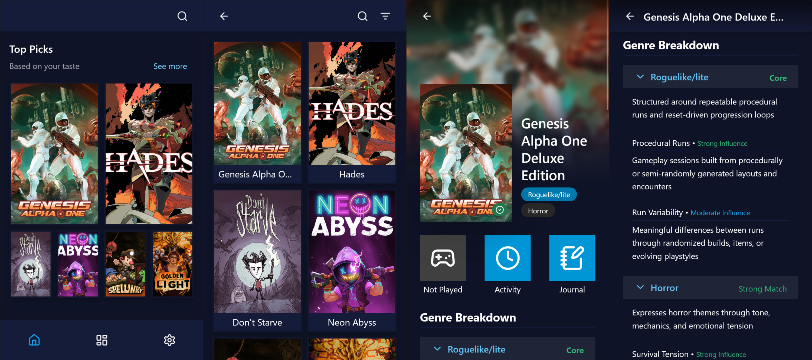
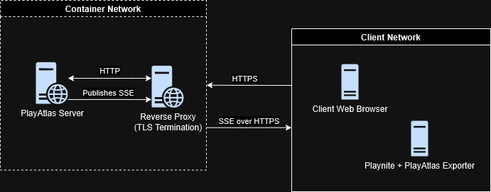
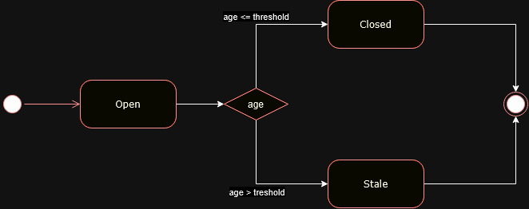

# PlayAtlas

[](https://github.com/jguih/playatlas/actions/workflows/pull-request.yml)

<h3 align="center">
A self-hosted recommendation engine that turns your <strong>Playnite</strong> library into an intelligent, searchable knowledge base.
</h3>

<p align="center">

</p>

## Links

- [Public Documentation](https://jguih.github.io/playatlas/)
- [Architecture Decision Records](./docs/adr/)

## Introduction

**PlayAtlas** is a self-hosted recommendation and classification engine designed to operate on top of a **Playnite**-managed gaming library.

It introduces a deterministic, versioned scoring system that evaluates games across multiple structural dimensions (e.g., Roguelike intensity, Survival mechanics, Narrative focus), transforming a static collection into an explainable, queryable knowledge space.

The system runs entirely within the user’s local network and does not depend on any third-party services.

## Motivation

Modern storefronts are highly optimized for acquisition-driven discovery. They excel at recommending games you don’t yet own.

But a different question often goes unanswered:

> From the 1,000+ games I already own, what should I play next?

[**Playnite**](https://playnite.link/) already solves the hardest problem: aggregating and normalizing a user’s distributed game libraries into a single, unified source of truth.

**PlayAtlas** builds on top of that foundation, introducing a deterministic, **multi-dimensional classification scoring engine** that transforms a static library into a structured space of **explainable genre** intensity and structural patterns.

Instead of recommending what to buy, **PlayAtlas helps users rediscover what they already have**.

It does so without relying on external services, opaque algorithms, or cloud infrastructure.

## System Overview

PlayAtlas consists of three components operating within the same local network:

- **Playnite Host**  
  The user’s gaming machine running Playnite with the **PlayAtlas Exporter** extension.  
  The exporter is responsible for **locally persisting session state** and **synchronizing game metadata** with the server.

- **PlayAtlas Server**  
  A **self-hosted web server** that **maintains** the synchronized game library and game sessions, **classifies** games into explainable genres and **manages** client trust.

- **Web Client**  
  A **browser-based interface** accessible from desktop or mobile devices.  
  The client interacts with the server over HTTP and reflects server-authoritative state.

### Data Flow

The **PlayAtlas Exporter** operates in an **offline-first** manner:

1. Session events are durably persisted locally.
2. Synchronization with the server occurs opportunistically.
3. Delivery follows an at-least-once model.
4. The server validates state transitions and enforces domain rules.

All external communication occurs over HTTPS via a reverse proxy. Internal communication between reverse proxy and application server occurs over isolated HTTP within the container network.

## Application Architecture

<p align="center">

</p>

> **Figure 1**: PlayAtlas Architecture Diagram

### Network and Trust Model

The PlayAtlas server is not directly exposed. It communicates only with the reverse proxy over an isolated container network using plain HTTP.

- The reverse-proxy terminates a TLS connection for external clients.
- Clients are only allowed to communicate with the reverse-proxy through HTTPS.
- Clients must authenticate before interacting with protected API endpoints or subscribing to domain event streams:
    - The Web browser client must present a valid Session Id.
    - PlayAtlas Exporter extension must include a valid signature on every request.
- The PlayAtlas Exporter is not trusted until approved by the user.

### Responsibility Boundaries

The PlayAtlas Server is the single source of truth for all persistent domain state.

- **PlayAtlas Exporter**
    - Local durability of game sessions.
    - Offline-first ingestion.
    - Enforces single-open-session invariant.
    - Retries synchronization.

- **PlayAtlas Server**
    - Persists and reconciles game sessions long-term.
    - Maintains the synchronized game library.
    - Authoritative domain state.
    - Validates legal state transitions.
    - Produces classification scores using deterministic **scoring engines**.
    - Publishes domain events.

- **Web Client**
    - Reflects server state.
    - Does not enforce domain rules.
    - Requires authenticated session.
    - Caches server data for faster processing.
    - **Computes query-time recommendations** using server-provided **classification vectors** (**cosine similarity** over normalized scores).

### Game Session Ingestion Model

<p align="center">

</p>

> **Figure 2**: Game Session State Machine Diagram

Game Sessions are created by the Exporter in response to Playnite events and are durably persisted locally before any network interaction. The Exporter is responsible for ensuring local consistency before attempting synchronization with the server.

The server stores sessions long-term and validates all state transitions.

- Only one open Game Session per game is allowed.
- Game Sessions are durably persisted before network calls.
- Delivery is at-least-once.
- Reconciliation happens before opening a new session.
- Close operations are idempotent.
- Server enforces transition legality.

### Event Propagation Model

Domain events are published by the server using [SSE](https://developer.mozilla.org/en-US/docs/Web/API/Server-sent_events) (Server Sent Events). Both Web and Exporter clients subscribe to the event stream.

- The server is the single publisher of **public** domain events. Clients do not emit events directly to each other.
- UI updates are driven by server-authoritative state.
- Exporter may react to server-side changes, for example, to allow changing the local Playnite state.

### Scoring Engine Architecture

A **score engine** is a modular component responsible for computing classification scores for games and producing a structured breakdown that explains how the score was derived.

Each classification (e.g., _Horror_, _RPG_, _Survival_) has its own independent score engine. Engines are versioned, deterministic, pure, side-effect free and designed to evolve safely over time while preserving historical data.

The server produces deterministic classification scores. Recommendation ranking is computed client-side using vector similarity over those scores.

To learn more about the internals of score engines and how to create new ones, visit [Scoring Engine Architecture](/packages/@playatlas/game-library/src/application/scoring-engine/).

## Architecture Decision Records (ADRs)

PlayAtlas documents significant architectural decisions using ADRs.

These records capture:

- The context and constraints at the time of the decision.
- The trade-offs considered.
- The reasoning behind the chosen approach.
- When and why the decision should be revisited.

The goal is to make system boundaries, trust assumptions, and lifecycle rules explicit rather than implicit in code.

### Index

| ADR | Title | Status | Date |
|-----|------|--------|------|
| [ADR-0001](./docs/adr/0001-mobile-first-ui.md) | Mobile-first constrained layout | Accepted | 2026-03-02 |
| [ADR-0002](./docs/adr/0002-extension-registration-and-trust-model.md) | Extension registration and trust model | Accepted | 2026-03-03 |
| [ADR-0003](./docs/adr/0003-offline-first-game-session-ingestion.md) | Offline-first session ingestion and reconciliation model | Accepted | 2026-03-03 |

## Security Model

### Intended Deployment

**PlayAtlas is a self-hosted LAN application.**

It is designed to run inside a trusted local network and must not be exposed directly to the public internet.

The system assumes the following machines are trusted:

- The Linux host running the PlayAtlas server.
- The Windows machine running Playnite + Exporter.
- Browsers accessing the web interface from the same LAN.

PlayAtlas does not implement a hardened internet authentication model.
Instead, security is enforced at the application level through explicit approval and session authorization.

### Why the Server Requires Approval

The Playnite Exporter is treated as an **untrusted client by default**.

Knowing the server address alone is not enough to interact with PlayAtlas.

When a new exporter connects:

1. The server registers it as pending.
2. The user must explicitly approve it in the UI.
3. Only after approval can it send metadata or trigger synchronization.

Until approved, the exporter cannot:

- upload game data
- modify stored information
- trigger sync operations

This prevents another machine on the network from pretending to be your Playnite instance and injecting data into your library.

### Trust Direction

Trust is established **by the server, not by the extension**.

The exporter assumes the user entered the correct server address and does not verify the server’s identity.
The server, however, verifies and authorizes the exporter before allowing any interaction.

This creates a simple zero-trust rule inside the LAN: **every client must be explicitly approved**, even inside the local network.

## Consistency and Guarantees Table

A concise table summarizing the core system invariants and behavioral guarantees.

| Concern | Guarantee | Enforced By |
|----------|------------|--------------|
| Domain Authority | PlayAtlas Server is the single source of truth for all persistent domain state | Server |
| Game Session Concurrency | At most one open game session per game | Exporter |
| Game Session Durability | Game sessions are **persisted locally** before any network interaction | Exporter |
| Game Session Delivery | At-least-once delivery semantics | Exporter |
| Game Session Close | Close operations are **idempotent** | Server |
| Game Session State Transition Validity | Illegal game session transitions are rejected | Server |
| External Domain Event Publishing | Server is the single publisher of externally visible domain events (SSE). Internal module-level events may exist within each component but are not exposed across boundaries |
| Client Communication | Clients never communicate directly with each other | Architecture Boundary |
| Classification Determinism | Scoring engines are deterministic, pure, and side-effect free | Server |
| Recommendation Determinism | Given identical classification vectors and weights, recommendation ranking is deterministic | Client |
| Transport Security | All external communication occurs over HTTPS | Reverse Proxy |

## Deployment Model and Constraints

PlayAtlas is designed as a self-hosted LAN application with clear separation between components.

### Non-Goals

The following scenarios are explicitly **out of scope**:

- Direct internet exposure without additional hardening.
- Running server and exporter on the same machine as the intended long-term deployment model.
- Internet-facing authentication or multi-tenant security models.

PlayAtlas does not attempt to provide a hardened internet security model. It assumes a trusted LAN boundary and enforces security at the application level through explicit client approval and authentication.

### Architectural Rationale

This deployment constraint ensures:

- Clear transport security boundaries.
- Reduced attack surface.
- Explicit trust establishment.
- Operational simplicity

## Testing Strategy

PlayAtlas follows a layered testing approach designed to protect domain invariants and synchronization guarantees.

Test layers include:

- **Domain Unit Tests**: Validate core invariants (Game Session lifecycle, scoring determinism, transition legality).
- **Application / Service Tests**: Validate command handlers, reconciliation flows, and authentication boundaries.
- **Integration Tests**: Validate synchronization flows, classification reconciliation, and module interaction.
- **Frontend Integration Tests**: Validate client-side synchronization behavior and recommendation computation.

The goal is not just coverage, but **behavioral confidence**. Critical invariants (idempotent close, single-open-session rule, deterministic scoring) are explicitly tested.

Continuous Integration runs the full test suite on every change.

## Getting Started

To install PlayAtlas, please visit the official documentation at [Quick Start](https://jguih.github.io/playatlas/overview/quick-start/)

## Development Setup

### Local Development Server

First, install dependencies with:

```bash
pnpm install
```

Then, to start the local development server, run:

```bash
pnpm dev
```

Then, open a browser and navigate to **http://localhost:3001**.

### Building Container Image

To build the Svelte application container image, run the following command at the project's root:

```bash
docker build --tag playatlas:latest --target prod .
```

### Running Production Container

If you want to run a local Podman container to test the final image, transfer it from Docker to the Podman local registry:

```bash
docker save playatlas | podman load
```

You can deploy the container using the example Ansible role at `podman/playatlas`.

Alternatively, you may use this Podman Run command:

```bash
podman run -d \
  --name playatlas \
  -v playatlas-data:/app/data \
  -e TZ=America/Sao_Paulo \
  -e PLAYATLAS_LOG_LEVEL=0 \
  -p 127.0.0.1:3000:3000/tcp \
  docker.io/library/playatlas
```

### Running Tests

To run all unit and integration tests:

```bash
pnpm test
```

To run all unit tests:

```bash
pnpm test:unit
```

To run all integration tests:

```bash
pnpm test:integration
```
